# Reno Express

_Proyecto realizado con tecnología .Net core 5 Arquitectura microservicios a nivel general, a nivel proyectos se ha implementado arquitectura Clean Code._
------------------------------
_Para objetos de transferencia se utilizo Automapper_

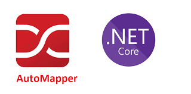
------------------------------
_Como ORM se utilizo EntityFramework Core_

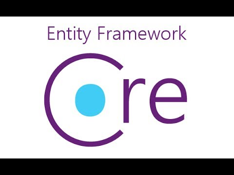
------------------------------
_Para el manejo de seguridad se emplea la herramienta de Json Web Token (JWT)_

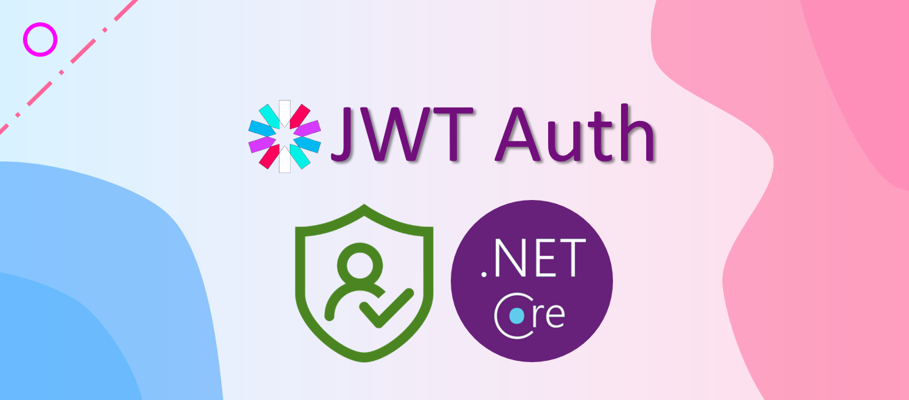
------------------------------
_Para este ejercicio se desarrollo este modelo de ER, como se trabajo con Code first de entity framework, la base de datos se genera con código_

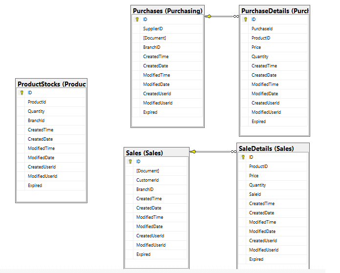

## Arquitectura Microservicios 

_Arquitectura que se base en fragmentar en pequeños servicios y que cada servicios realice una unica tarea, el siguiente diagrama muestra la arquitectura a nivel general de todo el sistema._


### Gateway API

_Es un proyecto API basado en Core 5 con integracion a Ocelot para el manejo de las APIs_


### Purchasing.Api

_Es un proyecto API basado en Clean Architecture  es el encargado de gestionar todo lo relacionado con las compras de productos_

Documentacion para los endpoint Urlbase/swagger

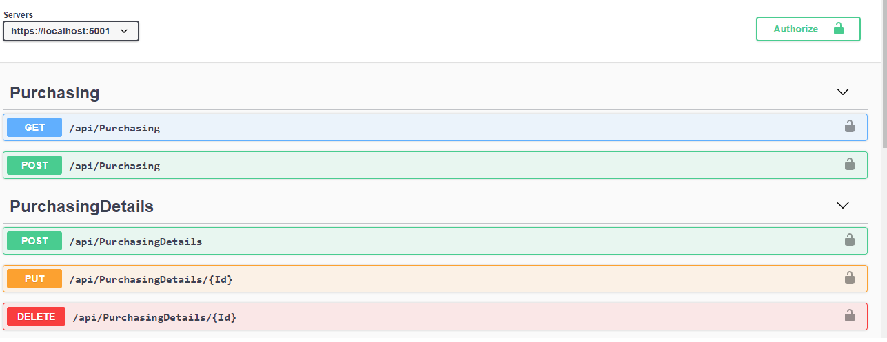

------------------------------
### Sales.Api

_Es un proyecto API basado en Clean Architecture  es el encargado de gestionar todo lo relacionado ventas de productos_

Documentacion para los endpoint Urlbase/swagger

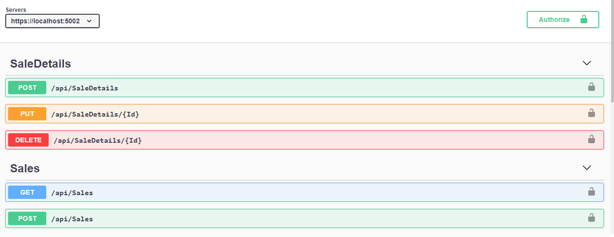

-----------------------
### Stock.Api

_Es un proyecto API basado en Clean Architecture es el encargado de gestionar todo lo relacionado con incrementar y disminuir el stock de productos_

Documentacion para los endpoint Urlbase/swagger

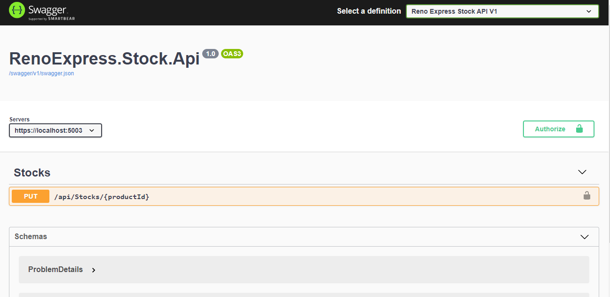

-----------------------
### Arquitectura General Clean + DDD

_A vista general podemos observar las capas en el modelo DDD (Domain Drive Design)_

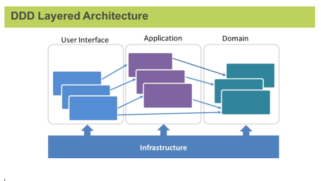

### Arquitectura Clean en cada proyecto

_Todos los proyectos anteriores estan basados en clean architecture o tambien conocido como modelo en capas de cebolla_


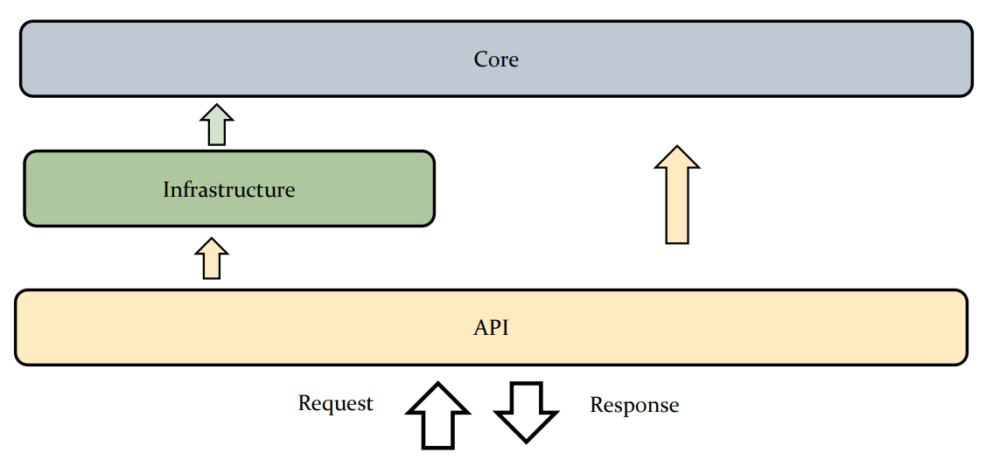

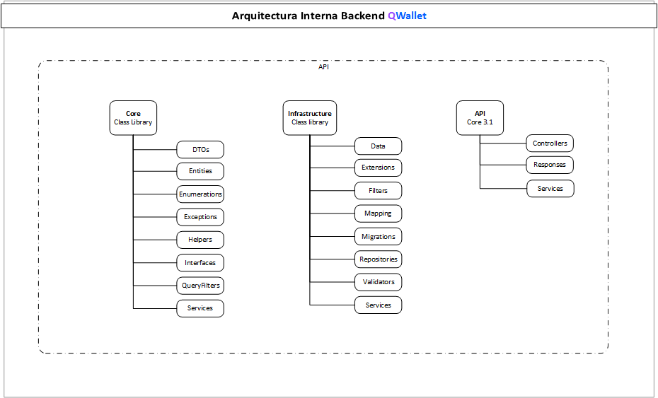

###  Capa Core
_Esta capa contiene recursos que son parte fundamental de nuestro sistema_

##### DTOs
_Contiene todos los objetos que se utilizan para responser a las peticiones a los que se les domina Data Transfer Object para no utilizar la entidad._

##### Entities
_Contiene todos los objetos que representan las entidades de una base de datos basados en entity framework._

##### Exceptions
_Contiene todos los objetos que representan el manejo de exceptiones o el control del flujo de exeptiones._

##### Helpers
_Contiene todos los objetos que nos ayudan en una determinada tarea._

##### Interfaces
_Contiene todas las interfaces o contratos para poder hacer uso a la inyeccion de dependencia._

##### QueryFilters
_Contiene objetos que se utilizan para filtrar la informacion en las consultas._

##### Services
_Contiene objetos que realizan la logica de negocio del core del sistema, sin utilizar dependecias._

-----------------------
###  Capa Infrastructure
_Esta capa contiene recursos que se utilizan para la entrada y salidad de datos de nuesto sistema_

##### Data
_Contiene el contexto de datos de nuestra aplicacion si hubiera un seed de datos acá es el lugar ideal_

##### Extensions
_Contiene el las extensiones que utiliza la aplicacion como las inyeciones de las clases y las interfaces_

##### Filters
_Contiene objetos que captura las exepciones en la capa de filters_

##### Mapping
_Contiene el objeto que crea el mapeo de las clases que utiliza automapper_
##### Migrations
_Contiene objetos que contienen el registro de cada migracion aplicada al sistema_

##### Repositories
_Contiene objetos que gestionan la conexion a la base de datos por medio del Patron Repositorio y el patron unit of work, como tambien Api repositorio_

-----------------------
###  Capa API Presentacion
_Esta capa contiene recursos que se utilizan para presentar los datos en nuestro sistema son los endpoint_

##### Controllers
_Contiene objetos llamados controladores que permiten exponer los endpoint con los diferentes verbos_

##### Models o Responses
_Contiene objetos simples que se utilizan para crear la estructura de una respuesta de los endpoint_


## Instalacion
_Para poder correr el proyecto es necesario crear la base de datos y configurar la direccion y puerto que se va a utilizar en los proyectos_

##### Crear la base de datos
_Debemos establecer cualquiera de las Api como proyecto principal_

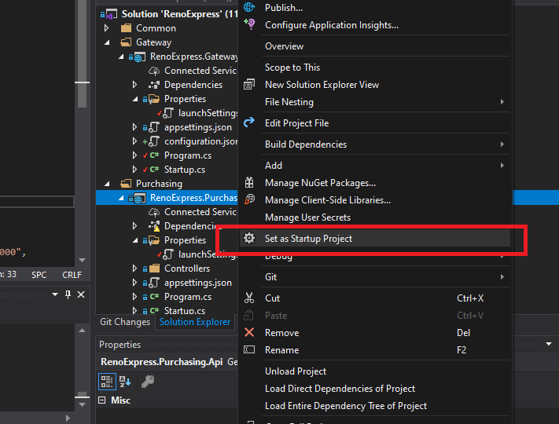

 _Una vez establecido como proyecto pricipal, debemos ubicarnos en la consola de comando de nuget y establecer o seleccionar del mismo proyecto la capa infrastructura_

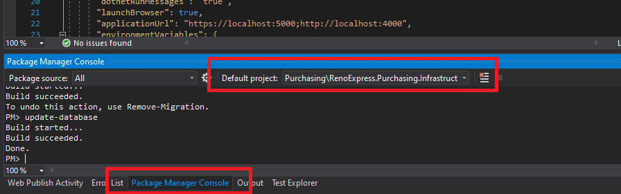

 _ejecutar el siguiente comando_

```
PM> update-database
```
 _Debemos ejecutar el mismo proceso con todos los proyectos_

##### Configuracion de nuestras APIs y Gateway
_Debemos verificar la configuracion de la urlbase de nuestra Gateway API y de nuestras APIs en general, si deseamos cambiar los parametros por algun motivo este es el archivo:
- RenoExpress.xxx.Api
 - Properties
 	- launchSetting.json_

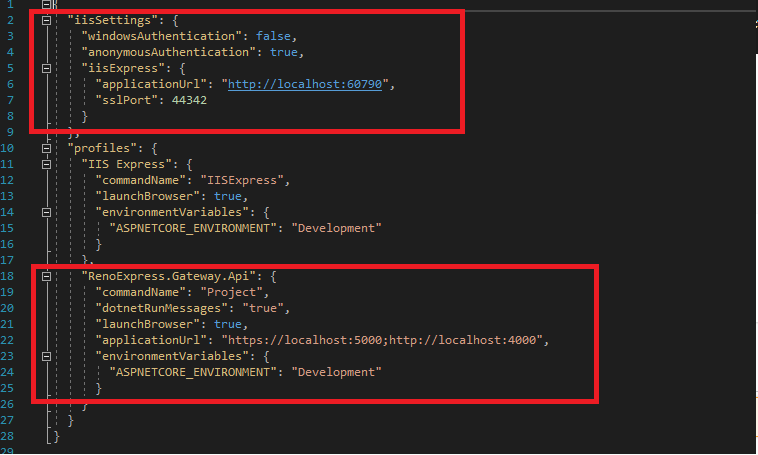

##### Configuracion de nuestra Gateway Configuration.json
_En esta seccion se leera la URLBase de las API y la nueva ruta que tendrá con el gateway tanto como host y puerto_

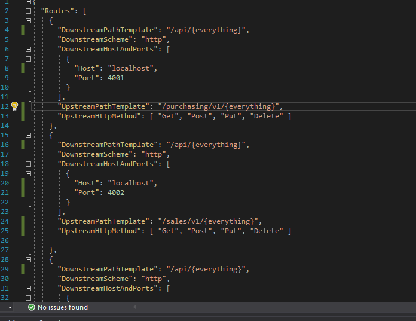

 _Dentro de Routes tenemos las siguientes secciones:_

```
  DownstreamPathTemplate: /api/v1/{everything}, // Representa el endpoint de nuestra API

      DownstreamScheme: http, // Representa el protocolo de conexion eje. https

      DownstreamHostAndPorts: [
        {
          Host: 192.168.1.54, // Representa la UrlBase de nuestra API

          Port: 4001     // Representa el puerto de nuestra API

        }
      ],
      UpstreamPathTemplate: /sales/v1/{everything},  // Representa el nuevo endpoint que expondra el gateway

      UpstreamHttpMethod: [ Get, Post, Put, Delete ], // los verbos disponibles en los endpoints
```

## Patrones de Diseño

_Los patrones de diseño nos ayudan para la mantenibilidad apropiada del sistema, en este modelo usamos dos para el acceso a datos en persistencia_

##### Repository Pattern
_Se basa en tener un repositorio para las acciones básicas de nuestro sistema con relación a persistencia(CRUD), un repositorio genérico para las tareas mas comunes._

##### Unit Of Work
_Se basa en tener un centralizado las instancias de los repositorios extendibles del repositorio generico, con esto se logra centralizar y tener accesso solo a este objeto e instanciar el repositorio de cada objeto en específico._


- [ASP.NET Core](https://github.com/aspnet/Home)

